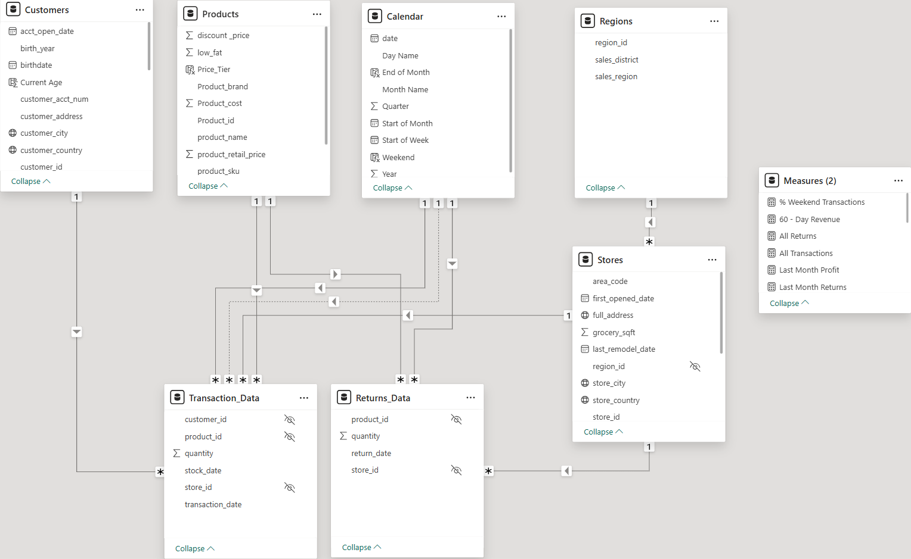
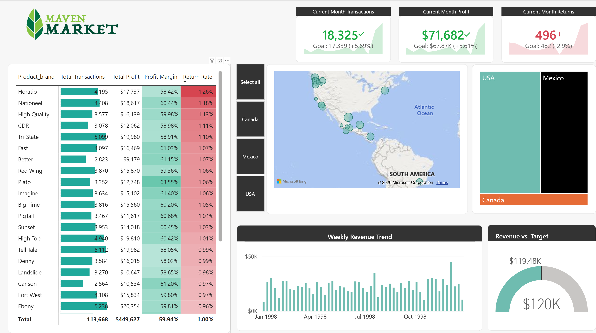
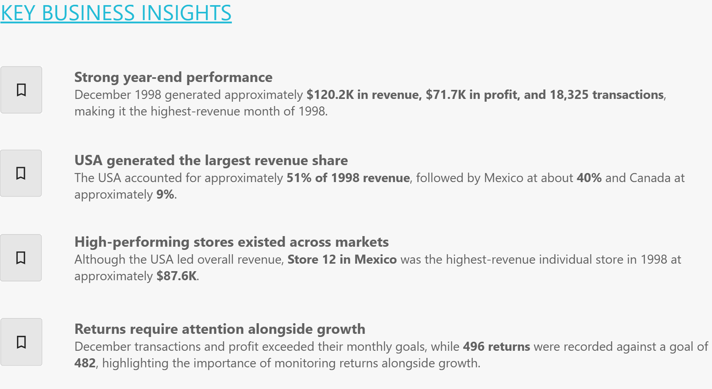
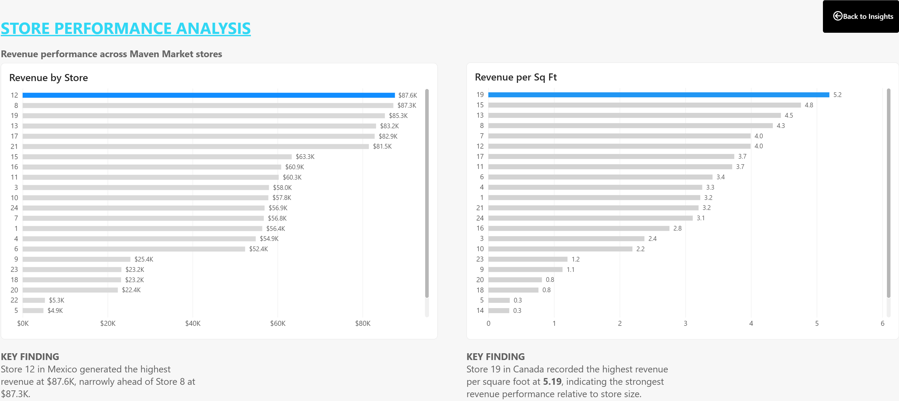
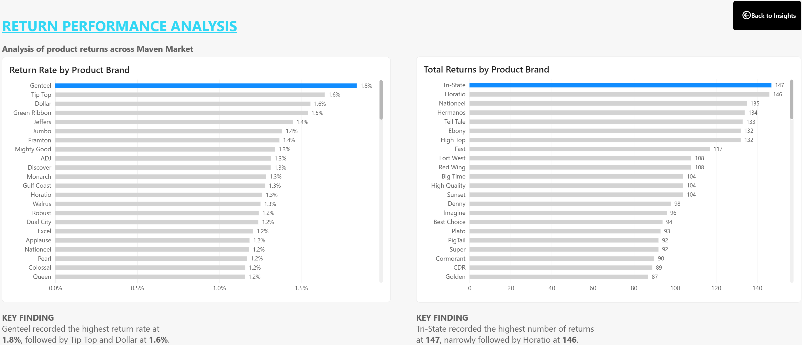

# Maven Market Sales & Performance Analysis

A Power BI business intelligence project analyzing Maven Market retail performance across sales, profitability, returns, products, stores, and geographic markets.

## Project Overview

The objective of this project was to develop an interactive business intelligence solution that provides management with a clear view of retail performance across products, stores, geographic markets, and time.

The analysis focuses on monitoring key performance indicators, comparing current performance with targets, identifying revenue and profitability trends, evaluating store performance, and examining product returns alongside overall business performance.

## Dataset

The analysis uses the Maven Market retail dataset, including:

- Transaction data for 1997 and 1998
- Customer information
- Product and pricing information
- Store and regional information
- Product return records
- Calendar/date data

The project analyzes more than **269K transaction records**, representing over **10K customers**, **1,560 products**, and **24 stores**.

## Tools & Technologies

- Power BI
- Power Query
- DAX
- Data Modelling
- Data Visualization
- Business Intelligence

## Data Preparation

Power Query was used to prepare the data for analysis. Key preparation activities included:

- Importing and transforming source data
- Validating field types and analytical dimensions
- Integrating transaction and return data with lookup tables
- Creating calculated fields required for analysis
- Preparing a dedicated date dimension for time-based analysis

## Data Model

The Power BI model separates transactional activity from descriptive dimensions.

Transaction and returns data function as fact tables, while Customers, Products, Calendar, Stores, and Regions provide the analytical dimensions. A dedicated Measures table centralizes reusable DAX calculations.

## Measures & KPIs

DAX measures were developed to evaluate:

- Total Transactions
- Total Revenue
- Total Profit
- Profit Margin
- Total Returns
- Return Rate
- Current-Month Performance
- Previous-Month Comparisons
- Revenue Trends
- 60-Day Revenue
- Monthly Target Performance
- Weekend Transactions

## Topline Performance Dashboard

The main dashboard provides a management-level view of transactions, profit, returns, product performance, geographic performance, revenue trends, and performance against monthly targets.

## Supporting Analysis

Additional report pages were developed to move beyond topline KPIs and investigate the business findings in greater detail.

### Key Business Insights

A dedicated insights page summarizes the most decision-relevant findings from the report and provides navigation to the supporting analysis.

### Store Performance Analysis

Store-level analysis compares total revenue with revenue per square foot, helping distinguish overall sales performance from performance relative to store size.

### Return Performance Analysis

Return analysis compares product brands using both return rate and total returns, providing complementary views of return frequency and return volume.

## Key Business Insights

### 1. Strong year-end performance

December 1998 generated approximately **$120.2K in revenue, $71.7K in profit, and 18,325 transactions**, making it the highest-revenue month of 1998.

### 2. USA generated the largest revenue share

The USA accounted for approximately **51% of 1998 revenue**, followed by Mexico at about **40%** and Canada at approximately **9%**.

### 3. High-performing stores existed across markets

Although the USA led overall revenue, **Store 12 in Mexico generated approximately $87.6K**, making it the highest-revenue individual store in 1998.

### 4. Returns require attention alongside growth

December transactions and profit exceeded their monthly goals, while **496 returns were recorded against a goal of 482**, highlighting the importance of monitoring returns alongside growth.

## Business Recommendations

- **Investigate return drivers:** Review brands, products, and stores contributing disproportionately to returns.
- **Study high-performing stores:** Compare strong-performing locations with lower-performing stores to identify differences in product mix, customer demand, store characteristics, or regional performance.
- **Monitor market concentration:** Continue tracking geographic revenue contribution and evaluate opportunities to strengthen performance in lower-contributing markets.

## Skills Demonstrated

Power BI · Power Query · DAX · Data Modelling · Fact & Dimension Tables · KPI Development · Time Intelligence · Data Visualization · Business Analysis · Insight Communication

## Live Case Study

For the full portfolio presentation of this project, view the live case study:

https://nnamdionu.github.io/maven-market.html

## Author

**Nnamdi Onu**  
Business Analyst | Data Analyst | Business Intelligence

LinkedIn: https://www.linkedin.com/in/nnamdi-onu-828a5b90/  
Portfolio: https://nnamdionu.github.io/
